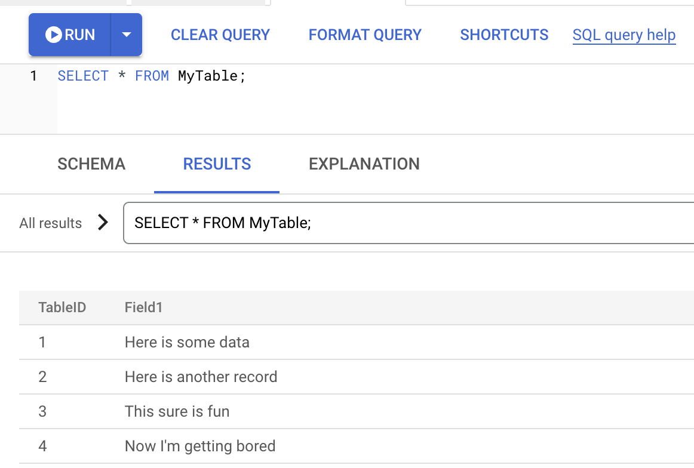

# Creating Spanner Instances and Databases (Console)

## Overview

In this lab, you create Spanner instances and databases using the Google Cloud Console.

## Objectives

In this lab, you learn how to:
* Create free trial Spanner instances. 
* Compare Spanner configuration options.
* Create Spanner databases using the Console. 
* Create Spanner databases using the PostgreSQL dialect.


## Setup and Requirements

![[/fragments/start-qwiklab]]


![[/fragments/cloudshell]]


## Task 1. Create a free trial instance


1. On the Google Cloud Console title bar, click the __Navigation Menu__ (). Scroll to the Database section and click __Spanner__.

2. Click the __Start a Free Trial__ button and name your instance `my-free-instance`. Select any region you like from the configuration dropdown. If you aren't sure what region to select, choose `us-east5 (Columbus)` and then click __Create Free Trial Instance__. 

__Note:__ If your are prompted to run the turotial, click the __Close__ button. 


3. Wait for the instance to be created, then you should be redirected to the __Instance Overview__ page. Click the __Create Database__ button, you may need to scroll to the bottom to find it. Name your database `my-database`, choose __Google Standard SQL__, then scroll down and click the __Create__ button. 

4. It should bring you to the details of the database and show you an overview and allow you to create a schema. If instead it stays on the Overview screen, you will see your database listed so you can click on it to go to its details page. 

5. Click the __Create Schema__ button at the top of the page. 

6. Enter the following CREATE TABLE statement, and then click the __Submit__ button. 

```
CREATE TABLE MyTable (
     TableID INT64 NOT NULL, 
     Field1 STRING(MAX) NOT NULL
) PRIMARY KEY (TableID);
```

7. Wait for the operation to complete. Your table should appear in the list of tables for that database. Click the table to see its details. 

8. Hover over the Table navigation pane on the left, and select the __Query__ menu. 

9. Change the query so it is similar to what is shown below and run it. Assuming you have no syntax errors, it should tell you 1 row was inserted. In the query you are simply inserting a record.  

```
INSERT INTO
  MyTable (TableID,
    Field1)
VALUES
  (1, "Here is some data");
```

10. Repeat the previous steps to add a few more records. Don't forget to change the `TableID` field each time so it is unique. You can enter any values you like for `Field1`. Just add 2 or 3 more records. 

11. Click the __Clear Query__ and run the following SELECT query. 

```
SELECT * FROM MyTable;
```

12. Examine the results in the Console. You can also click on the __Data__ tab on the side to browse the data.




## Task 2. Examining Spanner configuration options

1. In the top-left corner of the Spanner workspace area, click the __All instances__ link. 

2. Click the __Create Instance__ button and name your instance `my-second-instance`. 

3. In the __Choose a configuration__ section, click the __Compare Region Configurations__ button. <div> In the resulting pane, you must select two configurations to compare. In the first dropdown, select the Regional configuration `us-central1 (Iowa)`. In the second dropdown, select Multi-region configuration `name3 (Northern Virginia/South Carolina/Iowa)`. </div><div>Take note of the differences between replicas, availability, and the costs. </div><div>Change the first dropdown to the Multi-region configuration `nam-eur-asia1 (Iowa/Oklahoma/Belgium/Taiwan/South Carolina)` and compare the replicas and the costs between the two multi-region configuration. </div>

4. Close the __Compare region configurations__ pane. Return to the configuration screen and set the configuration to __Regional__ and `us-central1 (Iowa)`.

5. In the __Allocate compute capacity__ section, change the __Unit__ dropdown to __Nodes__. 

6. In the __Summary__ section, note the costs and maximum storage capacity. Increase the number of nodes to see the changes to costs and capacity. 

7. In the __Allocate compute capacity__ section, change the __Unit__ dropdown to __Processing Units__. Processing units are added in increments of 100. Set the value to 100 (*this is the smallest Spanner instance possible*).

8. Note the costs and capacity. Click __Create__ to create the instance. 


## Task 3. Creating the Pets database

1. As you did earlier, create a database called `pets-db` in the second instance.

2. Add the tables `Owners` and `Pets` to the database using the following DDL code. 

```
CREATE TABLE Owners (
     OwnerID STRING(36) NOT NULL, 
     OwnerName STRING(MAX) NOT NULL
) PRIMARY KEY (OwnerID);

CREATE TABLE Pets (
     PetID STRING(36) NOT NULL, 
     OwnerID STRING(36) NOT NULL, 
     PetType STRING(MAX) NOT NULL,
     PetName STRING(MAX) NOT NULL,
     Breed STRING(MAX) NOT NULL,
) PRIMARY KEY (PetID);
```

3. Add a couple owners and pets to the tables as you did earlier in the exercise. If you need some help, the insert queries would be similar to what is shown below. 

```
INSERT INTO
  Owners (OwnerID, OwnerName)
VALUES
  ("ca9fdb5c-97b5-4030-91f2-5cf5d7573d59", "Doug");
```

```
INSERT INTO
  Pets (PetID, OwnerID, PetType, PetName, Breed)
VALUES
  ("3be181a7-bafb-40f0-8068-7a021ed5794a", "ca9fdb5c-97b5-4030-91f2-5cf5d7573d59", "Dog", "Noir", "Schnoodle");
```

__Note:__ The primary keys for this database are not integers, but 36 character strings. These keys are meant to be universally unique identifiers (UUIDs). You could enter any unique strings less than or equal to 36 characters and it would work. If you want to generate proper UUIDs though, you can make the following request in a browser and at the top of the page, a UUID will be shown. 

```
https://duckduckgo.com/?q=uuid
```


## Bonus Task 4. Creating a PostgreSQL database

1. Create a second database in your Spanner instance. This time, choose PostgreSQL when prompted to select a database dialect. As a reminder, make sure you are at the __Instance Overview__ page. Click the __Create Database__ button. 

2. The DDL code for the Pets database using PostgreSQL syntax is as follows. Note, you cannot enter this on the database create page like you can do when using Google Standard SQL. Also, you must enter these queries by using the __Create Table__ button not the __Query__ button on the side navigation panel.

```
CREATE TABLE Owners (
        OwnerID VARCHAR(36) PRIMARY KEY,
        OwnerName VARCHAR(1024) NOT NULL
    );

CREATE TABLE Pets (
        PetID VARCHAR(36) NOT NULL, 
        OwnerID VARCHAR(36) NOT NULL, 
        PetType VARCHAR(1024) NOT NULL,
        PetName VARCHAR(1024) NOT NULL,
        Breed VARCHAR(1024) NOT NULL,
        PRIMARY KEY (PetID)
    );
```

### **Congratulations!** You have created Spanner instances and databases using the Google Cloud Console.


![[/fragments/endqwiklab]]

![[/fragments/copyright]]

