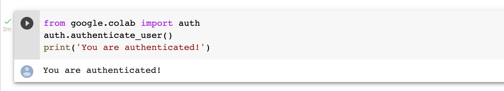

# LAB TITLE

## Overview

In this lab, you will run the Python code to create Spanner instances and databases. You will also see how to create, retrieve, and delete records from databases using both the Google Standard SQL and PostgreSQL dialects. 

## Objectives

In this lab, you learn how to:
* Use Python to create and delete Spanner instances and databases
* Program Spanner databases that use the PostgreSQL dialect

## Setup and Requirements

![[/fragments/start-qwiklab]]

![[/fragments/cloudshell]]

## Task 1. Programming Spanner databases with Python

1. From your Qwiklabs lab instructions, make note of your username, password, and Google Cloud project ID. You will need these in a minute. 

2. Go to the following URL: https://github.com/drehnstrom/spanner-examples/blob/main/colab-notebooks/Spanner_Samples_Python.ipynb 

3. This is a Jupyter notebook with the Python code for creating and using Spanner Instances and databases. Click on the __Open in Colab__ icon (). This will open the notebook in an online Jupyter environment provided by Google. 

4. You will first need to log in with your Qwiklabs credentials. Hover over the first code cell and click the run button that appears. 
In the warning that appears, click __Run anyway__. Then click __Allow__ when asked to allow this notebook to access your Google credentials.

5. When asked to Sign in with Google, make sure you use the Qwiklabs credentials, not your own credentials. When prompted, allow Colaboratory access to you project. You should get a message that you are authenticated. 

()

6. Run the next cell to install the Python Spanner client library. __Note:__ After the cell completes you will see a __Restart Runtime__ button. You will need to do that before continuing. 

7. In the third cell, you will need to change the `project_id` variable to your Qwiklabs project ID. Do that and then run the cell. 

8. Read the text prior to each code cell and run each one. Take the time to understand what the code is doing. 

## Task 2. Programming Spanner databases using the PostgreSQL dialect

1. Go to the following URL: https://github.com/drehnstrom/spanner-examples/blob/main/colab-notebooks/Spanner_PostgeSQL.ipynb, and click on the __Open in Colab__ icon ().

2. Authenticate as you did with the last notebook. Make sure to use your Qwiklabs credentials. Also, make sure to change the Project ID variable to your Qwiklabs project. 

### **Congratulations!** You have run the Python code to create Spanner instances and databases. You also saw how to create, retrieve, and delete records from databases using both the Google Standard SQL and PostgreSQL dialects. 

![[/fragments/endqwiklab]]

![[/fragments/copyright]]

